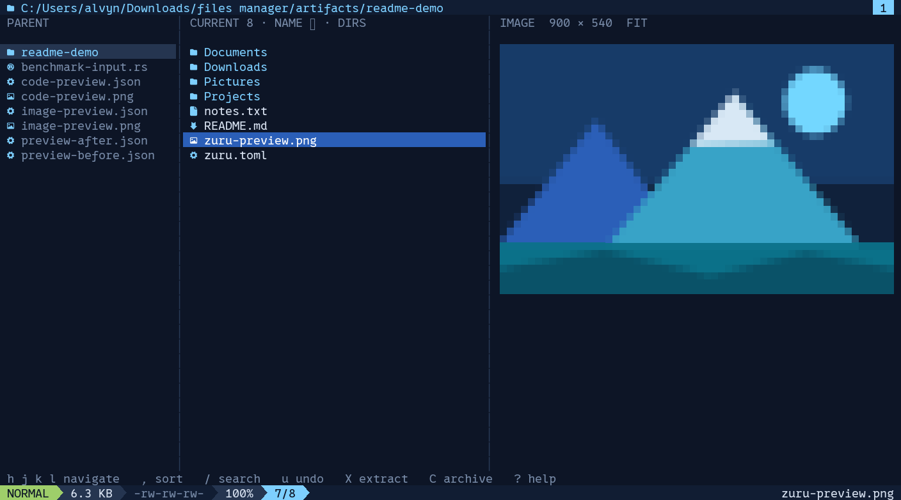

# Zuru

A Rust terminal file manager inspired by yazi: three Miller columns, a dark navy palette, a full-width blue selection, Nerd Font icons, image/music/video previews, and a segmented status bar.



## Download

### [Download Zuru for Windows](https://github.com/alvyn16/zuru/releases/latest/download/zuru-windows-x86_64.exe)

The download is a portable app: no installer and no Rust toolchain are required. Open Windows Terminal in any folder and run the downloaded `zuru-windows-x86_64.exe`. Choose a **Nerd Font** in your terminal for the intended icons.

All published versions and checksums are available on the [Releases page](https://github.com/alvyn16/zuru/releases/latest).

## Build from source

```sh
cargo run
cargo run -- /path/to/folder
cargo run -- --config zuru.example.toml
```

Building requires Rust 1.90+ and an interactive terminal. The crate uses Rust 2021. Choose a **Nerd Font** in your terminal for the icons and powerline separators. Windows Terminal / PowerShell, Linux, and macOS are supported by the underlying libraries; this build was tested on Windows.

For an optimized binary:

```sh
cargo build --release
# Windows: .\target\release\zuru.exe
# macOS/Linux: ./target/release/zuru
```

The default starting directory is the process's current working directory. Press **?** for the keyboard guide and **q** to quit. Errors and panics restore raw mode, the cursor, and the original terminal screen.

If your shell sets `NO_COLOR`, unset it to enable the theme (PowerShell: `$env:NO_COLOR = $null`). Selection also uses bold text for monochrome terminals.

## Keys

| Keys | Action |
|---|---|
| `h j k l`, arrows | Parent, down, up, enter directory / open file |
| `Enter`, `o` | Enter a directory or use the OS default file opener |
| `e` | Open in `$EDITOR`, then `$VISUAL`; defaults to Notepad on Windows or vi on Unix |
| `gg`, `G`, Home, End | First / last item |
| Page Up / Down, `Ctrl-u` / `Ctrl-d` | Move by a listing page |
| `y`, `x`, `p` | Copy, cut, paste |
| `r` | Rename; Enter accepts, Esc cancels |
| `B` | Bulk rename selected items in `$EDITOR`, review every change, then apply |
| `C` | Create a `.zip`, `.tar`, `.tar.gz`, or `.tgz` archive from the selection |
| `X` | Extract selected archives into new folders |
| `u` | Open undo history; Enter undoes the newest change |
| `,` | Sort by name, extension, size, or modified time; reverse order or toggle folders first |
| `d`, Delete | Open trash confirmation; Enter, `y`, or `d` confirms; `n` / Esc cancels |
| Space | Toggle selection and move down |
| `v` | Start / end a visual selection range; move with j/k |
| `a` | Select every visible item |
| Esc | Clear selection or the active filter |
| `/` | Live fuzzy filter; Enter keeps it, Esc restores the previous filter |
| `s` / `S` | Recursively search filenames / text inside files |
| `J` / `K`, `Ctrl-j` / `Ctrl-k` | Scroll preview down / up |
| `z` | Toggle image fit / full-width view; J/K pan a tall image |
| `.` | Show / hide dotfiles |
| `R`, `Ctrl-r` | Refresh |
| `b`, `m` | Browse bookmarks / save current directory as a bookmark |
| `w` | Open the task panel; `c` requests cancellation |
| `gh`, `gd` | Home / Downloads |
| `t` | New tab in the current directory |
| Tab, Shift-Tab, `1`–`9` | Next, previous, direct tab selection |
| `Ctrl-w` | Close the current tab |
| `:` | Command input |
| `?`, F1 | Five-page, plain-language keyboard guide with current bindings |
| `q`, `Ctrl-c` | Quit after active file operations finish |

In input fields, Backspace removes the last character, Ctrl-u clears the input, and bracketed paste is supported. The keyboard guide and bookmark picker use j/k or arrows, Enter, and Esc.

Commands: `:cd PATH`, `:find NAME`, `:grep TEXT`, `:mkdir NAME`, `:touch NAME`, `:bookmark NAME`, `:archive NAME.zip`, `:extract`, `:undo`, `:reload`, `:help`, `:quit`. Paths can contain spaces; `~` expands to your home directory. Commands are built in and do not execute a shell.

## Previews and responsiveness

- Images are decoded and resized/encoded **off the UI thread** with `image` and `ratatui-image`. Automatic detection selects Kitty, iTerm2, or Sixel when available, with Unicode half-blocks otherwise. Detection may take about two seconds at startup. Use `--protocol halfblocks` to bypass it or force another supported protocol with `--protocol kitty|iterm2|sixel`.
- Image fit mode preserves aspect ratio. Width mode scales to the preview width and lets J/K scroll the image vertically. Preview results are cached by file stamp and viewport. The worker preloads up to four nearby files and keeps viewport-sized QOI thumbnails with their original dimensions in the per-user Zuru cache, avoiding another source-image read after restarting. `thumbnail_cache_mb` controls its size and `0` disables it. Animated images show their first frame.
- UTF-8 text uses syntect syntax highlighting, line numbers, and vertical scrolling. Text is capped at 512 KiB / 4,000 lines by default; very long lines are limited to 800 characters. Limited previews are labeled.
- Music previews show tags, duration, sample rate, bitrate, channel count, and embedded cover art for supported audio formats. Video previews show a still frame, duration, resolution, and codecs when `ffmpeg` and `ffprobe` are on your PATH. Enter / `o` plays media in the system's default app. Artwork and video frames use the persistent thumbnail cache; media is excluded from neighboring-file preloading. Video processes stop when navigation cancels their request and have a five-second timeout.
- Directory previews show a sorted miniature listing. ZIP, TAR, TAR.GZ, and TGZ previews show contained paths and unpacked sizes without extraction. Unsupported/binary files show size, MIME guess, modified time, and permissions. Windows permission strings approximate read-only status; they do not represent NTFS ACLs.
- Directory reads use jwalk on a background worker. Directory previews use lightweight names and types, while full metadata is loaded only for the active listing. A single-slot mailbox drops queued requests superseded by new navigation; cancellation also stops stale directory and preview work early. Preview work has its own bounded cache and worker, and file operations run on a separate serialized worker.
- `notify` refreshes the current and parent listings and the selected directory's preview after external changes. Tabs retain independent directories, cursors, filters, and selection sets; switching tabs reloads their filesystem state. Watcher failures are visible and manual refresh remains available. Listings render only the visible rows, even in very large directories.

Images larger than 16,384 pixels in either dimension, or requiring over 128 MiB of decoder allocations, are refused with a preview error. The terminal can be resized while workers run. Below 48 × 8, a compact resize message replaces the panes.

## Search and task behavior

`s` searches names recursively and `S` searches file contents recursively from the current directory. Searches run on a cancellable background worker, are case-insensitive, honor `.gitignore`, skip hidden paths unless dotfiles are enabled, and return real filesystem entries that can still be previewed, opened, selected, copied, moved, renamed, or trashed. Press Esc to return to the directory. Name searches stop at 10,000 results; content searches stop at 5,000 results and inspect at most the first 2 MiB of each non-binary file.

The task panel shows byte and item progress, transfer speed, the current path, and recent outcomes. Press `w` while an operation runs, then `c` to request cancellation. Copy and move check cancellation between files and throughout large-file transfers; trash cancellation takes effect between top-level items.

The sort menu applies changes immediately. Each tab remembers its sort field, direction, and folders-first choice while Zuru is running; a new tab inherits the active tab's choices.

## File operation behavior

Copy / paste works on files, directory trees, and multiple selections. When a destination exists, Zuru pauses and offers Skip, Keep Both, or Replace, plus apply-to-all versions. Keep Both generates a collision-free `(copy)` name. Replace sends the existing destination to the OS trash before copying. Copying a folder into itself or a descendant is rejected. Copy/move of symlinks, trees containing symlinks, and special files is intentionally refused in v1; browsing and previewing ordinary symlink targets still works.

Moves copy to the destination first, then send the source to the **OS trash**. This works across volumes and keeps a recoverable original. If trashing fails, both copies remain and the error says so. Failed or cancelled copies keep the original and any completed or partial destination for inspection. Bulk operations report how many succeeded and which failed. Rename rejects existing targets. File operations are not transactional and folder timestamps/ACLs are not preserved by recursive copying.

Bulk rename writes the selected filenames to a temporary UTF-8 file, one name per line, and opens it in `$EDITOR`. After the editor closes, Zuru shows an old → new review, flags invalid names, duplicates, and existing destinations, and only enables apply when the plan is valid. Applying runs as a tracked background task. A two-phase rename through unique temporary names makes swaps and rename cycles safe; failures trigger a best-effort rollback and any incomplete rollback is reported.

Deletion uses the `trash` crate only; there is no permanent-delete command. The app refuses to exit while its file-operation worker is busy.

Zuru keeps the 20 most recent undoable operations in memory. Press `u`, review the newest action, and press Enter to undo it. Rename, move, copy, file/folder creation, archive creation, and extraction are undoable. Trash and replaced-file restoration are available where the `trash` crate can enumerate and restore OS trash items. Undo history is intentionally cleared when Zuru exits.

Archive creation and extraction run as tracked, cancellable tasks. Extraction always creates a new folder named after the archive, never overwrites an existing folder, rejects path traversal and links, and caps expanded data at 16 GiB. A failed extraction keeps its partial folder so it can be inspected or removed through the recorded undo action.

## Shell and file-picker integration

Use `--chooser-file PATH` to start Zuru as a file picker. Enter returns the highlighted file, while Space selects several files and Enter returns all selected files. Zuru writes one absolute path per line; cancelling leaves the output file empty.

```powershell
zuru.exe --chooser-file .\chosen-files.txt
```

Use the included shell wrapper when you want your shell to follow the folder you were viewing when Zuru exited:

```powershell
# PowerShell
. .\scripts\zuru.ps1
z
```

```sh
# bash or zsh
source scripts/zuru.sh
z
```

The wrappers invoke Zuru with `--cwd-file`, read the final absolute directory, and change the calling shell's working directory after a clean exit. Pass a directory or any normal Zuru argument to `z`.

## Configuration

```sh
cargo run -- --config-path
cargo run -- --print-config
```

Copy `zuru.example.toml` to the path reported by `--config-path`, or pass `--config PATH`. `ZURU_CONFIG` overrides the default path. A missing config uses built-in defaults; malformed files produce actionable errors. All theme colors and navigation/action bindings can be overridden. Each configured action replaces its default list. Duplicate bindings are rejected, so moving a key between actions requires updating both. Escape / Enter inside dialogs and direct tab digits remain built in.

Use `:reload` after editing the config. Changes to the terminal graphics protocol take effect on restart. Bookmarks saved with `m` are stored in `bookmarks.toml` beside the active config and take precedence over its bookmark entries. Home / Downloads / Documents are populated when available.

For `$EDITOR` paths containing spaces, set the variable to the executable path or quote the executable when adding arguments. For example, `code --wait` waits until the editor tab closes. Zuru suspends the TUI while a terminal editor runs.

## Verify

```sh
cargo fmt --check
cargo clippy --all-targets -- -D warnings
cargo test --all-targets
# Optional real OS integration: sends two small disposable fixtures to your trash.
cargo test --test core os_trash_and_move_work_with_disposable_files -- --ignored
```

Tests cover navigation, per-tab sorting, bulk-rename validation and swaps, tab isolation, filtering, recursive name/content search, task progress, cancellation, conflict handling, persistent thumbnails, visual selection, filesystem watching, config validation, recursive copies, preview routing, image fit/panning, and real Ratatui buffers at multiple terminal sizes. The OS trash test is separate from the default suite.

An optional visual QA helper renders the actual Ratatui TestBackend buffer, including image half-blocks:

```sh
cargo run --example snapshot -- /path/to/folder artifacts/snapshot.json optional-filename.png
python scripts/render_snapshot.py artifacts/snapshot.json artifacts/snapshot.png --font /path/to/NerdFontMono.ttf
```

The Python helper requires Pillow; it is not needed to build or run Zuru. Native Kitty/iTerm2/Sixel rendering still needs testing in the respective terminal.

## Structure

`app.rs` handles modes, tabs, key routing, and worker coordination; `ui.rs` renders the panes and overlays; `files.rs` reads directories and metadata; `preview.rs` creates and preloads preview content; `media.rs` reads music metadata and generates video frames; `archive.rs` creates, extracts, and lists archives; `search.rs` performs recursive searches; `operations.rs` runs tracked file tasks and undo; `config.rs` loads TOML and bookmarks; `worker.rs` supplies the latest-request mailbox; `main.rs` owns the terminal lifecycle and shell integration.
